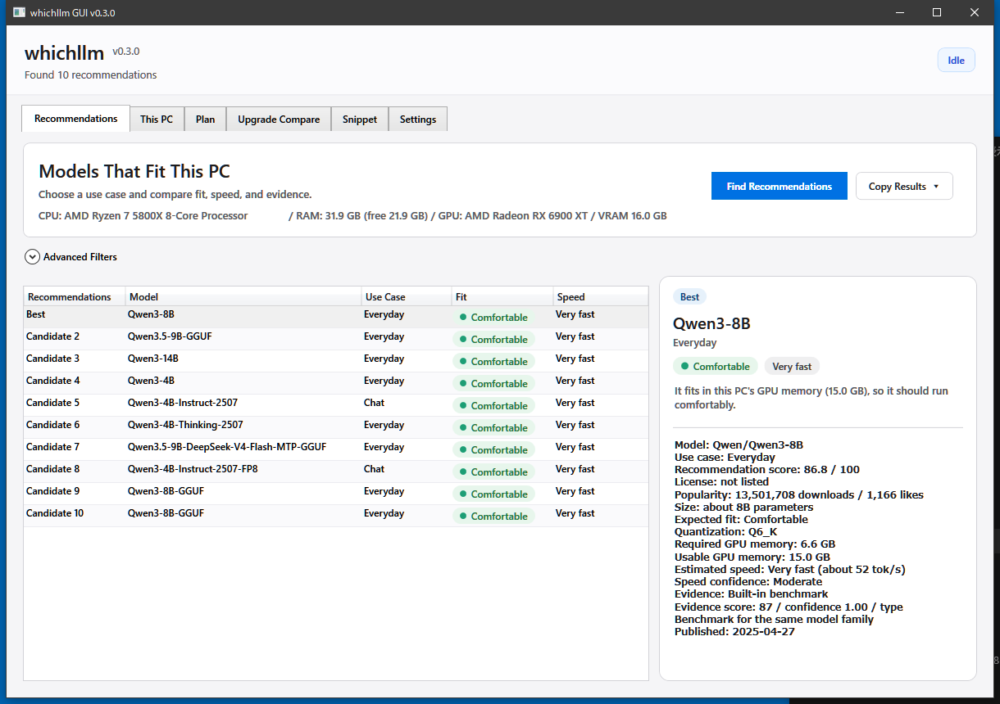

# whichllm GUI

A Windows 10 / 11 GUI app for choosing a local LLM that fits your PC. It looks at your CPU, RAM, GPU, and VRAM, then ranks models by fit, speed, and evidence.

[日本語 README](README.md)



## What Is This?

whichllm GUI helps you decide which local LLM to try before you set up a runtime. It answers practical questions like:

- Which models are likely to run on this PC?
- Will the model fit in GPU memory?
- What changes if I upgrade the GPU?
- What Python snippet should I start from?

It intentionally does not run, download, or chat with models.

## Quick Start

1. Download `whichllm-gui-v0.4.0-win-x64.zip` from Releases.
2. Extract the ZIP anywhere.
3. Run `WhichLlm.Gui.exe`.
4. Press `Find Recommendations` on the first screen.

Python is not required. The release ZIP is a self-contained `win-x64` build.

## Main Views

- `Recommendations`: ranks models for this PC with use case, fit, speed, and evidence.
- `This PC`: shows detected CPU, RAM, GPU, VRAM, and free disk space.
- `Plan`: estimates required memory for a selected model and quantization.
- `Upgrade Compare`: compares candidate GPUs and the expected best model for each.
- `Snippet`: generates Python code and a `uv run --no-project ...` command.
- `Settings`: shows cache path, Hugging Face endpoint, and display language.

## Reading Recommendations

- `Use Case`: everyday use, chat, coding, reasoning/math, images, or search/classification.
- `Fit`: `Comfortable` means the model should fit in GPU memory. `Runs, but heavy` means it may spill from GPU memory into CPU/RAM.
- `Speed`: a plain-language speed estimate.
- `Evidence`: distinguishes direct, variant, base_model, line_interp, self_reported, and none, then discounts weaker evidence by confidence.

## Key Features

- Benchmark evidence is resolved in this order: direct, variant, base_model, line_interp, then self_reported.
- Benchmark data uses layered sources: LiveBench, Artificial Analysis, Aider, Open LLM Leaderboard, and Chatbot Arena. Frozen sources are capped, and older lineages are demoted.
- Hugging Face fetching checks popular models, recently updated GGUF models, and trending models.
- Benchmark inheritance is avoided when the model differs by more than 2x in parameter count, including draft, MTP, and fork-like derivatives.
- Compatibility notes cover NVIDIA Compute Capability and AMD/Apple/Intel OS/backend mismatches.
- Japanese / English display switching is supported, and the app remembers the last selected display language on next launch.
- GPU suggestions are sorted by hardware generation, and `QAT` is treated as real only when the model variant or repo/file name actually indicates QAT.

## Hardware Detection

GPU detection tries:

- NVIDIA: `nvidia-smi`
- AMD Radeon: `%HIP_PATH%\bin\hipInfo.exe`
- Intel Arc and similar: `xpu-smi`
- Fallback: Windows CIM/WMI and registry data

If automatic detection is wrong, you can manually override VRAM and bandwidth in the app.

## Data and Cache

Model metadata is fetched from the Hugging Face API. If `HF_ENDPOINT` is set, the app uses that endpoint.

The fetcher checks popular models, recently updated GGUF models, and trending models.

Benchmark data is merged in layers:

- current: LiveBench, Artificial Analysis, Aider
- frozen: Open LLM Leaderboard v2, Chatbot Arena ELO
- fallback: a minimal seed only when live sources are unavailable

Frozen-only entries from older model lineages are demoted so stale leaderboard scores do not overtake newer families.

If neither internet access nor an existing cache is available, the app uses a minimal fallback list of common small and mid-sized models so the first screen is still useful.

Cache location:

```text
%LocalAppData%\whichllm-gui\cache
```

Cache TTL:

- Models: 6 hours
- Benchmarks: 24 hours

## Development

Requires the .NET SDK.

```powershell
dotnet restore
dotnet test tests\WhichLlm.Tests\WhichLlm.Tests.vbproj
dotnet build src\WhichLlm.Gui\WhichLlm.Gui.vbproj
dotnet publish src\WhichLlm.Gui\WhichLlm.Gui.vbproj -c Release -r win-x64 --self-contained true
```

Publish output:

```text
src\WhichLlm.Gui\bin\Release\net10.0-windows\win-x64\publish\
```

## Credits and License

whichllm GUI itself is released under the MIT License. See [LICENSE](LICENSE).

This GUI is inspired by:

- whichllm: https://github.com/Andyyyy64/whichllm
- llmfit: https://github.com/AlexsJones/llmfit

See [THIRD_PARTY_NOTICES.md](THIRD_PARTY_NOTICES.md) for upstream copyright notices.
