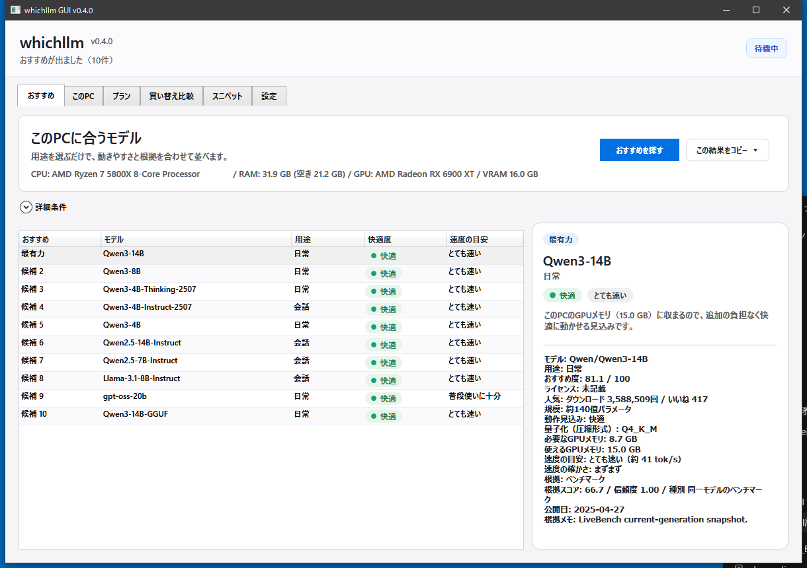

# whichllm GUI

**PCのスペックを見て、「このパソコンで動かしやすいローカルLLM」を教えてくれるWindowsアプリです。**
Pythonのインストールは不要。ZIPを展開して起動するだけで使えます。

[English README](./README.en.md)



---

## これは何？

ローカルLLM（自分のPCで動かすAIモデル）を試したいけれど、「どのモデルを選べばいいのか」「うちのPCで動くのか」が分からない――そこを助けるためのツールです。

CPU・RAM・GPU・VRAMを自動で読み取り、いまのPCで快適に動きそうなモデルを、**用途・快適度・速度・根拠つき**で一覧にします。

### できること

- いまのPCに合うモデルを探す（`おすすめ`）
- 検出したハードウェアを確認する（`このPC`）
- 指定モデルの必要メモリを量子化ごとに試算する（`プラン`）
- GPUを買い替えたらどう変わるかを比較する（`買い替え比較`）
- モデルを動かすためのコードを生成する（`スニペット`）

### あえてやらないこと

このアプリは**モデルのダウンロードも実行もしません**。チャットUIもありません。
「動かす前に選ぶ」ことだけに集中した道具です。実際にモデルを動かす方法は[後述](#選んだあとどう動かす)します。

---

## 動かすまで（3ステップ）

### 1. ダウンロードする

[最新リリース](https://github.com/Meistertech-JP/whichllm-GUI/releases/latest)から `whichllm-gui-vX.Y.Z-win-x64.zip` をダウンロードします。
Windows 10 / 11（64bit）向けの自己完結版なので、**Python も .NET も別途インストールする必要はありません**。

### 2. 展開して起動する

ZIPを好きな場所に展開し、`WhichLlm.Gui.exe` をダブルクリックします。

> **「Windows によって PC が保護されました」と出たら**
> このアプリにはコード署名証明書を付けていないため、初回起動時にWindows SmartScreenの警告が出ることがあります。中身を確認したうえで実行するには、**「詳細情報」→「実行」** を押してください。
> 不安な場合は、次の「配布物の確認（任意）」で中身が改ざんされていないか照合できます。

### 3. 起動するだけ。おすすめが自動で出ます

起動するとハードウェア検出が走り、検出が終わると**このPCに合うモデルの一覧が自動で表示されます**。ボタンを押す必要はありません。これで完了です。

### 配布物の確認（任意）

リリースには各ZIPのSHA256チェックサムを同梱しています。ダウンロードしたファイルが壊れていないか・差し替えられていないか心配なときは、PowerShellで照合できます。

```powershell
Get-FileHash .\whichllm-gui-vX.Y.Z-win-x64.zip -Algorithm SHA256
```

表示された値が、リリースに記載のチェックサムと一致すればOKです。

---

## 結果の読み方（おすすめ画面）

`おすすめ` の一覧は、次の観点で読みます。

- **用途**：日常 / 会話 / プログラミング / 論理・数学 / 画像 / 検索・分類 から選びます。目的に合うモデルだけが残ります。
- **快適度**：
  - `快適` … GPUのメモリ内に収まる見込み。いちばん快適に動きます。
  - `動くが重め` … GPUからあふれてCPU/RAMも使う見込み。動きはしますが遅くなります。
- **速度の目安**：普段使いに十分か、とても速いか、をざっくり示します。
- **根拠**：その評価が何に基づくか（実測値か、近い系譜からの推定か）を区別し、確からしさでスコアを調整しています。

迷ったら、まず `快適` かつ用途が合うモデルから試すのがおすすめです。

---

## 選んだあと、どう動かす？

このアプリはモデルを実行しないので、選んだモデルは別のツールで動かします。

- **手軽に始めたい**：[Ollama](https://ollama.com) や [LM Studio](https://lmstudio.ai) のような実行アプリを使うと、コマンドやコードをほとんど書かずにモデルを動かせます。
- **コードで動かしたい**：`スニペット` タブで、選んだモデル向けのPythonコードと `uv run --no-project ...` コマンドを生成できます。そのままコピーして使えます。

whichllm GUIで「どれを動かすか」を決めてから、上のいずれかで実際に動かす、という流れになります。

---

## 画面の種類

| タブ | 何ができるか |
| --- | --- |
| `おすすめ` | このPCに合うモデルを一覧表示 |
| `このPC` | 検出したCPU / RAM / GPU / VRAM / ディスク空きを確認 |
| `プラン` | 指定モデルの必要メモリを量子化ごとに試算 |
| `買い替え比較` | GPU候補ごとに、最有力モデルや伸び幅を比較 |
| `スニペット` | 実行用のPythonコード・コマンドを生成 |
| `設定` | キャッシュ場所・Hugging Face接続先・表示言語を変更 |

---

## うまく動かないとき

- **GPUが検出されない / VRAMの値がおかしい**
  自動検出がうまくいかない場合は、`このPC` 画面でVRAMや帯域を手入力して試算できます。
  GPU検出は `nvidia-smi`（NVIDIA）→ `hipInfo.exe`（AMD）→ `xpu-smi`（Intel）→ WindowsのWMI/レジストリ、の順で試します。
- **複数のGPUを積んでいる**
  検出した全GPUを表示し、`おすすめ` の `対象GPU / グループ` から見積もりの対象を選べます。同世代をまとめて使う／特定の1台だけ／同一GPUのうち何台か（3台以上のとき2台だけ等）といった指定ができ、選んだ構成で適合度と速度を見積もります。世代やアーキテクチャが混在したGPUを、単純にVRAMを足し算して「動く」と判定することはしません。
- **インターネットに繋がっていない / 初回起動**
  オンライン取得もキャッシュも使えない場合は、画面が空にならないよう主要な小型〜中型モデルの最小候補を表示します。
- **表示言語を変えたい・キャッシュを消したい**
  `設定` タブから、日本語 / English の切り替えとキャッシュ場所の確認ができます。

---

## 仕組み（データとキャッシュ）

モデル情報はHugging Face APIから取得します。`HF_ENDPOINT` 環境変数が設定されていれば、その接続先を使います。人気順に加えて、最近更新されたGGUFモデルやトレンドのモデルも拾います。

ベンチマーク情報は複数の情報源を層にして統合しています。

- **current**：LiveBench / Artificial Analysis / Aider
- **frozen**：Open LLM Leaderboard v2 / Chatbot Arena ELO
- **fallback**：ライブ取得が全滅したときの最小seed

frozenにしか存在しない古い系譜のモデルは、世代の古さに応じてスコアを減衰させ、過大評価を避けています。

キャッシュの保存場所と有効期間は次のとおりです。

```
%LocalAppData%\whichllm-gui\cache
```

- モデル情報：6時間
- ベンチマーク情報：24時間

---

## 開発者向け

ビルドには.NET SDKが必要です。

```powershell
dotnet restore
dotnet test tests\WhichLlm.Tests\WhichLlm.Tests.vbproj
dotnet build src\WhichLlm.Gui\WhichLlm.Gui.vbproj
dotnet publish src\WhichLlm.Gui\WhichLlm.Gui.vbproj -c Release -r win-x64 --self-contained true
```

publishの出力先：

```
src\WhichLlm.Gui\bin\Release\net10.0-windows\win-x64\publish\
```

バージョンごとの変更点は[Releases](https://github.com/Meistertech-JP/whichllm-GUI/releases)を参照してください。

---

## ライセンスと参照元

whichllm GUI 本体は MIT License で公開しています。詳細は [LICENSE](./LICENSE) を参照してください。

このGUIは、次のプロジェクトを参考にしています。

- whichllm: <https://github.com/Andyyyy64/whichllm>
- llmfit: <https://github.com/AlexsJones/llmfit>

参照元プロジェクトの著作権表示は [THIRD_PARTY_NOTICES.md](./THIRD_PARTY_NOTICES.md) を参照してください。
